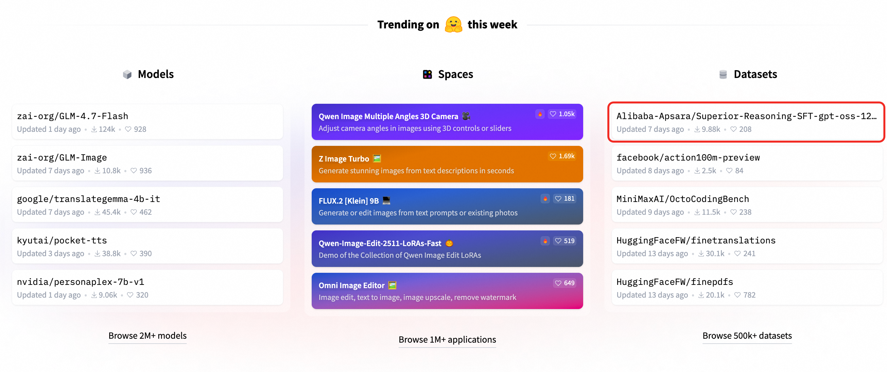

<h1 align="center"> Distribution-Aligned Sequence Distillation for Superior Long-CoT
Reasoning</h1>


[](https://github.com/D2I-ai/dasd-thinking)&#160;
<a href="https://arxiv.org/abs/2601.09088" target="_blank"></a>


[](https://huggingface.co/Alibaba-Apsara/DASD-4B-Thinking)&#160;
[](https://www.modelscope.cn/models/Alibaba-Apsara/DASD-4B-Thinking)&#160;


[](https://huggingface.co/Alibaba-Apsara/DASD-30B-A3B-Thinking-Preview)&#160;
[](https://www.modelscope.cn/models/Alibaba-Apsara/DASD-30B-A3B-Thinking-Preview)&#160;


[](https://huggingface.co/datasets/Alibaba-Apsara/Superior-Reasoning-SFT-gpt-oss-120b)&#160;
[](https://www.modelscope.cn/datasets/Alibaba-Apsara/Superior-Reasoning-SFT-gpt-oss-120b)&#160;

[](https://huggingface.co/datasets/Alibaba-Apsara/Superior-Reasoning-SFT-gpt-oss-120b-Logprob)&#160;
[](https://www.modelscope.cn/datasets/Alibaba-Apsara/Superior-Reasoning-SFT-gpt-oss-120b-Logprob)&#160;


## Distribution-Aligned Sequence Distillation

Distribution-Aligned Sequence Distillation is a highly efficient and advanced reasoning distillation pipeline. This pipeline leverages innovative techniques like temperature-scheduled learning, divergence-aware sampling, and mixed-policy distillation to achieve state-of-the-art results in mathematical reasoning, code generation, and scientific problem-solving, even with minimal training data. 
There are different variants:

- **DASD-4B-Thinking**: A lightweight reasoning model excelling in mathematical, scientific, and coding benchmarks, achieving competitive results with multi-stages-training, making it exceptionally data-efficient. It outperforms several larger models (e.g., 32B-scale) on critical benchmarks, including AIME24, AIME25, LiveCodeBench and GPQA-Diamond, despite its smaller size.

- **DASD-30B-A3B-Thinking-Preview**: A variant using a Mixture-of-Experts (MoE) architecture that scales up model capacity while maintaining efficiency through sparse expert routing. Notably, due to time constraints, we trained this model using only the Stage-1 data. Despite this limitation, it outperforms similar models in efficiency-quality trade-offs, showcasing significant improvements across multiple benchmarks like AIME25 and LiveCodeBench.


# 📣 News


*   **[2026-1-20]** 🔥 Our SFT Dataset **[Alibaba-Apsara/Superior-Reasoning-SFT-gpt-oss-120b](https://huggingface.co/datasets/Alibaba-Apsara/Superior-Reasoning-SFT-gpt-oss-120b)** currently ranks **\#1** on Hugging Face’s datasets trending leaderboard and **\#5** on the overall trending leaderboard.


*   **[2026-1-16]** 🔥 Our **[Technical Report](https://huggingface.co/papers/2601.09088)** ranks **fifth** in the Hugging Face Daily Papers.
*   **[2026-1-15]** 🎉 Our **Technical Report** for Distribution-Aligned Sequence Distillation is now available on [Arxiv](https://arxiv.org/abs/2601.09088).
*   **[2026-1-14]** 🎉 Our **Technical Report** for Distribution-Aligned Sequence Distillation is now available on [Github](https://github.com/D2I-ai/dasd-thinking/blob/main/dasd_technical_report.pdf).
*   **[2026-1-14]** 🔥 **SFT Dataset is released!** We have released the stage1 and stage2 datasets on [Hugging Face](https://huggingface.co/datasets/Alibaba-Apsara/Superior-Reasoning-SFT-gpt-oss-120b) and [ModelScope](https://modelscope.cn/datasets/Alibaba-Apsara/Superior-Reasoning-SFT-gpt-oss-120b).
*   **[2026-1-14]** 🔥 **DASD-30B-A3B-Thinking-Preview Model is released!** We have released the model checkpoint on [Hugging Face](https://huggingface.co/Alibaba-Apsara/DASD-30B-A3B-Thinking-Preview) and [ModelScope](https://modelscope.cn/models/Alibaba-Apsara/DASD-30B-A3B-Thinking-Preview).
*   **[2026-1-14]** 🔥 **DASD-4B-Thinking Model is released!** We have released the model checkpoint on [Hugging Face](https://huggingface.co/Alibaba-Apsara/DASD-4B-Thinking) and [ModelScope](https://modelscope.cn/models/Alibaba-Apsara/DASD-4B-Thinking).


## 📥 Model Zoo

| Model | Hugging Face | ModelScope |
| :-- | :-- | :-- |
| DASD-4B-Thinking | [](https://huggingface.co/Alibaba-Apsara/DASD-4B-Thinking) | [](https://www.modelscope.cn/models/Alibaba-Apsara/DASD-4B-Thinking)|
| DASD-30B-A3B-Thinking-Preview | [](https://huggingface.co/Alibaba-Apsara/DASD-30B-A3B-Thinking-Preview) | [](https://www.modelscope.cn/models/Alibaba-Apsara/DASD-30B-A3B-Thinking-Preview) |
| DASD-30B-A3B-Thinking | *To be released* | *To be released* |


## 📈 Performance

### 4B Dense Model Performance


| Model                           |      Data   | AIME24 | AIME25 | LCB v5 | LCB v6 | GPQA-D |
|---------------------------------|---------|--------|--------|--------|--------|--------|
| Qwen3-4B-Thinking-2507         |❌          | -      | 81.3   | -      | 55.2   | 65.8   |
| Qwen3-14B                     |❌           | 79.3   | 70.4   | 63.5   | -      | 64.0   |
| Qwen3-32B                     |❌           | 81.4   | 72.9   | 65.7   | -      | 68.4   |
| DeepSeek-R1-0528-Qwen3-8B     |❌          | 86.0   | 76.3   | 60.5   | -      | 61.1   |
| GLM-Z1-32B-0414             |❌            | 80.8   | 63.6   | 59.1   | -      | 66.1   |
| GLM-Z1-9B-0414            |❌              | 76.4   | 56.6   | 51.8   | -      | 58.5   |
| Mistral3-3B                 |❌             | -      | 72.1   | 54.8   | -      | 53.4   |
| Mistral3-8B                  |❌            | -      | 78.7   | 61.6   | -      | 66.8   |
| AM-thinking-v1                  |✅         | 85.3   | 74.4   | 70.3   | -      | -      |
| POLARIS-4B-Preview                |✅       | 81.2   | 79.4   | -      | -      | -      |
| OpenThoughts3-7B                  |✅       | 69.0   | 53.3   | 51.7   | -      | 53.7   |
| Pai-DistillQwen-ThoughtY-4B       |✅       | 76.7   | -      | -      | -      | 56.1   |
| Pai-DistillQwen-ThoughtY-8B         |✅     | 76.7   | -      | -      | -      | 62.1   |
| NVIDIA-OpenReasoning-Nemotron-7B    |✅     | 84.7   | 78.2   | 63.9   | -      | 61.4   |
| NVIDIA-Nemotron-Ultra-253B         |✅     | 80.8   | 72.5   | 68.1   | -      | 76.0   |
| **DASD-4B-Thinking (Ours)**       |✅       | **88.5**   | **83.3**   | **69.3**   | **67.5**   | **68.4**   |

### 30B MoE Model Performance

**DASD-30B-A3B-Thinking-Preview** (trained on **Stage 1 data only**) demonstrates incredible data efficiency.

| Model                                  | AIME25 | LCB v6 | GPQA-D | Average |
|----------------------------------------|--------|--------|--------|---------|
| gpt-oss-20b                            | 91.7   | 61.0  | 71.5   | 74.7    |
| Qwen3-30B-A3B-Thinking-2507            | 85.0   | 66.0   | 73.4   | 74.8    |
| NVIDIA-Nemotron-3-Nano-30B-A3B         | 89.1   | 68.3   | 73.0   | 76.8    |
| **DASD-30B-A3B-Thinking-Preview (Ours)**| 86.7   | 72.8   | 72.3   | 77.3    |


## 🧩 Why DASD Matters

DASD presents a systematic reexamining of sequence-level distillation and introduces **a novel distribution-aligned sequence distillation paradigm**. Using only 448K training samples, this approach substantially enhances the performance of a 4B-parameter dense model on mathematical, code, and scientific reasoning tasks, achieving state-of-the-art results among models of comparable size and even surpassing some larger models. Moreover, it provides an **open and data-efficient resource** for transferring long-form reasoning capabilities into student model while maintaining robust performance across multiple reasoning benchmarks.


### 1. **Open and Data-Efficient Resource**

* **Open-Source Model**: We release **DASD-4B-Thinking**, a compact yet capable 4B dense language model specialized in long chain-of-thought (Long-CoT) reasoning across mathematics, code generation, and scientific reasoning.


* **Open-Source Data**: We release the **Alibaba-Apsara/Superior-Reasoning-SFT-gpt-oss-120b**, allowing the community to reproduce our off-policy **temperature-scheduled** pipeline:
  * **105K** Low-Temperature responses for stability (Stage 1).

  * **330K** High-Temperature responses for diversity (Stage 2).

* **Proven Scalability**: The exact same data recipe generalizes effectively to larger architectures, as demonstrated by our **DASD-30B-A3B-Thinking-Preview** (MoE), which achieves competitive performance without extra RL.

### 2. **Distribution-Aligned Sequence Distillation**

Many distillation pipelines optimize only for answer correctness or rely on heuristic filtering, which can collapse reasoning diversity and amplify sampling bias. Apsara-Reason instead treats reasoning distillation as a **sequence-level distributional object**, and optimizes the student to better match the teacher’s behavior across the full trajectory.

The pipeline integrates three complementary mechanisms:

- **Temperature-scheduled Learning**: combines low-temperature trajectories (stability) with higher-temperature trajectories (diversity and exploration), improving both learning stability and coverage of teacher's modes.
- **Divergence-aware Sampling**: selects sequences based on teacher–student distributional mismatch at the sentence level and find target sequence-level distribution better supports effective learning.
- **Mixed-policy Distillation**: introduces a lightweight on-policy revision protocol after off-policy SFT, using student-generated prefixes with teacher rewrites to improve robustness and mitigating exposure bias of distilled model

Together, these components form a **coherent, distribution-aware sequence distillation pipeline** that improves the fidelity of reasoning transfer while remaining data-efficient, making strong long-reasoning behavior feasible in a 4B dense model.

<div style="text-align: center;">
  
</div>


## ⚡ Quick Start


```python
from transformers import AutoModelForCausalLM, AutoTokenizer

model_name = "Alibaba-Apsara/DASD-4B-Thinking"

tokenizer = AutoTokenizer.from_pretrained(model_name, trust_remote_code=True)
model = AutoModelForCausalLM.from_pretrained(
    model_name,
    torch_dtype="auto",
    device_map="auto",
    trust_remote_code=True,
)

prompt = "Natalia sold clips to 48 of her friends in April, and then she sold half as many clips in May. How many clips did Natalia sell altogether in April and May?"
messages = [
  {"role": "system", "content": "You are a helpful assistant."},
  {"role": "user", "content": prompt}
]

text = tokenizer.apply_chat_template(
    messages,
    tokenize=False,
    add_generation_prompt=True,
)

model_inputs = tokenizer([text], return_tensors="pt").to(model.device)

generated_ids = model.generate(
    **model_inputs,
    max_new_tokens=81920,
)

output_ids = generated_ids[0][len(model_inputs.input_ids[0]):].tolist()
content = tokenizer.decode(output_ids, skip_special_tokens=True)
print(content)
```

> Note: We include the system prompt, as it was used during all training stages. To ensure consistent output quality, we recommend including the same system prompt during actual usage; otherwise, the model's responses may be significantly affected.

For deployment, you can use sglang>=0.4.6.post1 or vllm>=0.8.5 or to create an OpenAI-compatible API endpoint:

- SGLang:

```
python -m sglang.launch_server --model-path Alibaba-Apsara/DASD-4B-Thinking --context-length 262144
```

- vLLM:
```
vllm serve Alibaba-Apsara/DASD-4B-Thinking --max-model-len 262144
```


## Training

We utilize [LLaMA-Factory](https://github.com/hiyouga/LLaMA-Factory) framework for training, which provides a convenient and efficient training pipeline.

### Training Setup

1. **Environment Setup**
   - Set up LLaMA-Factory following their official [documentation](https://github.com/hiyouga/LLaMA-Factory#installation).
   - Set up Liger-Kernel following their official [documentation](https://github.com/linkedin/Liger-Kernel?tab=readme-ov-file#installation).
   - Ensure all dependencies are properly installed and configured.

2. **Data Preparation**
   - Obtain the Alibaba-Apsara/Superior-Reasoning-SFT-gpt-oss-120b dataset from [🤗 Hugging Face](https://huggingface.co/datasets/Alibaba-Apsara/Superior-Reasoning-SFT-gpt-oss-120b) or [🤖 ModelScope](https://www.modelscope.cn/datasets/Alibaba-Apsara/Superior-Reasoning-SFT-gpt-oss-120b).
   - Format the dataset according to LLaMA-Factory's [data preparation guidelines](https://github.com/hiyouga/LLaMA-Factory/tree/main/data).

3. **Configuration**
   - Use our provided [configuration file](https://github.com/D2I-ai/dasd-thinking/blob/main/train/stage1.yaml).
   - The config file contains all necessary hyperparameters and training settings.


## 📜 Citation

If you find our work useful in your research, please consider citing:

```bibtex
@article{yan2026dasd,
  title={Distribution-Aligned Sequence Distillation for Superior Long-CoT Reasoning},
  author={Yan, Shaotian and Liu, Kaiyuan and Shen, Chen and Wang, Bing and Fan, Sinan and Zhang, Jun and Wu, Yue and Wang, Zheng and Ye, Jieping},
  year={2026},
  journal={arXiv preprint arXiv:2601.09088},
  url={https://arxiv.org/abs/2601.09088}
}

@article{liu2025where,
  title={Where Did This Sentence Come From? Tracing Provenance in LLM Reasoning Distillation},
  author={Liu, Kaiyuan and Yan, Shaotian and Miao, Rui and Wang, Bing and Shen, Chen and Zhang, Jun and Ye, Jieping},
  journal={arXiv preprint arXiv:2512.20908},
  year={2025}
}
```

